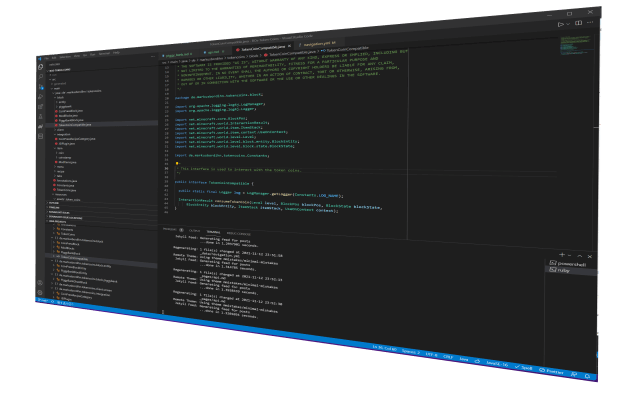

If you want to create new blocks or machines like a vending machine which are using token coin
items, we are offering a simple way / api for this.

## 🪙 The TokenCoinCompatible Interface

The token coin items are using a interface called **TokenCoinCompatible** to see if they could be used
with such block.
If you click with a coin on such a compatible block, token coin will automatically call the
**canConsumeTokenCoin** and **consumeTokenCoin** function of the target block.

Example:

```java
import de.markusbordihn.tokencoins.block.TokenCoinCompatible;

public class YourBlock extends Block implements EntityBlock, TokenCoinCompatible {

  @Override
  public boolean canConsumeTokenCoin(Level level, BlockPos blockPos, BlockState blockState,
      BlockEntity blockEntity, Player player, ItemStack itemStack) {
    ...
  }

  @Override
  public InteractionResult consumeTokenCoin(Level level, BlockPos blockPos, BlockState blockState,
      BlockEntity blockEntity, ItemStack itemStack, UseOnContext context) {
    ...
  }
}
```

The **consumeTokenCoin** will be only called if **canConsumeTokenCoin** returns true, which is the
default without any overwrite for all token coins.

With these passed parameters you can easily handle all kind of integrations.
The **itemStack** parameter will return the currently used token coin item stack which could be used
to get the value, material, motive of the coin or just to shrink or expand the item stack.

## 🪙 The CookieTokenCoinCompatible Interface

The cookie token coin items are using a separate interface called **CookieTokenCoinCompatible** to
see if they could be used with such block.
If you click with a cookie coin on such a compatible block, token coin will automatically call the
**canConsumeCookieTokenCoin** and **consumeCookieTokenCoin** function of the target block.

Example:

```java
import de.markusbordihn.tokencoins.block.CookieTokenCoinCompatible;

public class YourBlock extends Block implements EntityBlock, CookieTokenCoinCompatible {

  @Override
  public boolean canConsumeCookieTokenCoin(Level level, BlockPos blockPos, BlockState blockState,
      BlockEntity blockEntity, Player player, ItemStack itemStack) {
    ...
  }

  @Override
  public InteractionResult consumeCookieTokenCoin(Level level, BlockPos blockPos, BlockState blockState,
      BlockEntity blockEntity, ItemStack itemStack, UseOnContext context) {
    ...
  }
}
```

The **consumeCookieTokenCoin** will be only called if **canConsumeCookieTokenCoin** returns true,
which is the default without any overwrite for all cookie token coins.

With these passed parameters you can easily handle all kind of integrations.
The **itemStack** parameter will return the currently used token coin item stack which could be used
to get the value, material, motive of the cookie coin or just to shrink or expand the item stack.

## 🗄️ Mod Dependency

**Bo's Token Coins** depends on **Bo's Material Elements** for the additional kind of material like
steel and rods which are needed to craft the token coin items.

You can add these dependency in your main/resources/META-INF/mods.toml file:

```yaml
  [[dependencies.**REPLACE_WITH_YOUR_MOD_ID**]]
    modId="material_elements"
    mandatory=true
    # This version range declares a minimum of the current version up to but not including the next major version
    versionRange="[0.5.1,)"
    ordering="NONE"
    side="BOTH"

  [[dependencies.**REPLACE_WITH_YOUR_MOD_ID**]]
    modId="token_coins"
    mandatory=true
    # This version range declares a minimum of the current version up to but not including the next major version
    versionRange="[1.1.1,)"
    ordering="NONE"
    side="BOTH"
```

## 👾 Gradle Integration

For an easier development workflow, you should at the following lines to your build.gradle file,
which will automatically download **Bo's Token Coins** and **Bo's Material Elements** as dependency
for your local development environment.

```java
// Curse Maven Plugin
repositories {
    maven {
        url "https://www.cursemaven.com"
        content {
            includeGroup "curse.maven"
        }
    }
}

dependencies {

    ...

    // Required: Bo's Material Elements (dev dependency)
    implementation fg.deobf("curse.maven:token_coins-544494:3526791")

    // Required: Bo's Material Elements (dev dependency)
    implementation fg.deobf("curse.maven:material_elements-541620:3527198")
}
```
