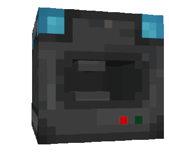
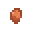
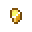
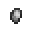
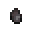
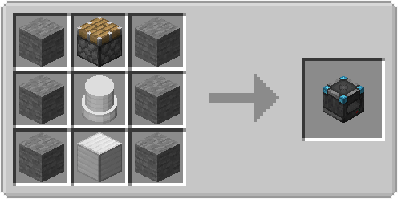
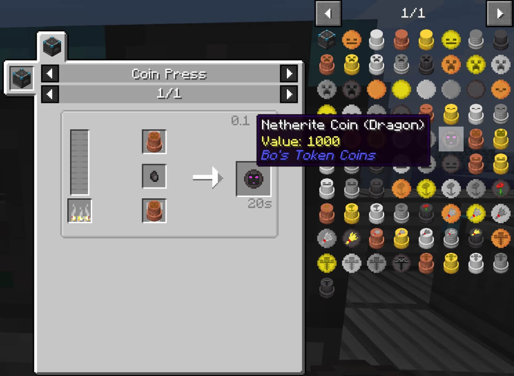
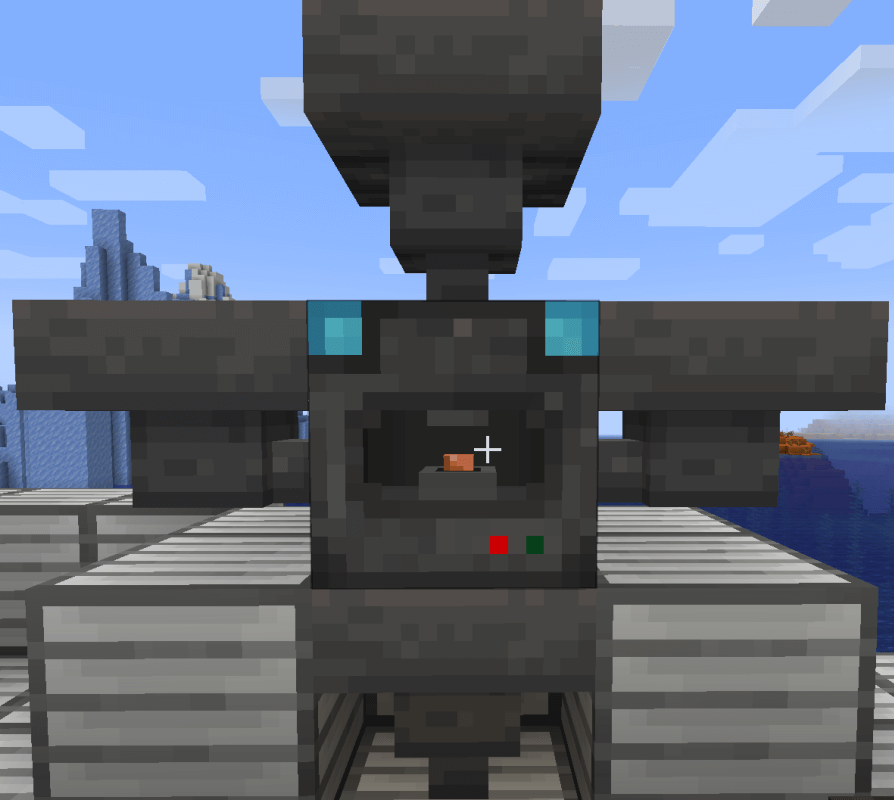

The coin press is used together with the coin stamps to craft the corresponding coins with basic material like:

 Copper Nuggets 
 Gold Nuggets 
 Iron Nuggets 
 Steel Nuggets 
 Netherite Nuggets 

## Crafting

To craft the coin press you need the following items:

- **6 x** Stone
- **1 x** Piston
- **1 x** Block of Iron
- **1 x** Iron Coin Stamp (see [Coin Stamp](../coin_stamps/#Crafting))

## Usage

To use the coin press you need to have at least the following material:

- **2 x** [Coin Stamps](../coin_stamps/) with the same motive
- **1..64 x** Copper, Gold, Iron, Steel or Netherite Nuggets
- **1 x** A fuel item like wood, coal, lave bucket, ...

Put the items in the correct slot and the machine should start working.

## Coin Press Recipes

The mod use custom recipes for the coins which are calculated by the first use.
But because the mod has a [JEI](https://www.curseforge.com/minecraft/mc-mods/jei) integration you can easily look them up.

## Hopper Support

The coin press has an auto sorting function and will automatically put the items in the correct slot, regardless of the connected face.
**The bottom face will be only use for the output of the corresponding coins.**

