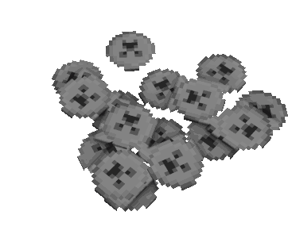
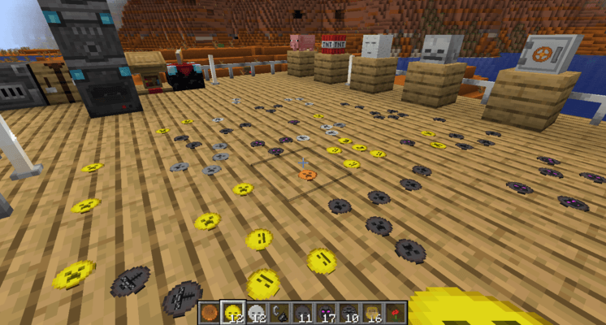

Coin stacks are decorative / interactive blocks which could be placed in world.

## Place a coin stack

Just hold a token coin in your hand and click on a empty block and you will place a token coin.
The max. size per block are 16 token coins.

## Remove a coin stack

Just destroy the coin stack and it will return you a single token coin for each hit.

## Limitation

Coin Stacks are limited to a max. of 16 token coins and can't be mixed inside a single block.

## Performance

Because coin stacks are more or less static blocks, placed blocks will cause no performance issues on the server.
