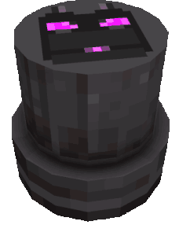
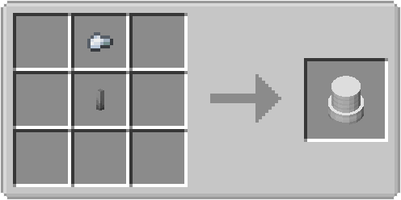
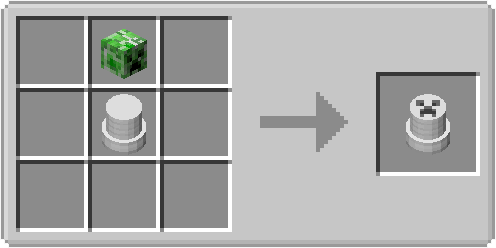
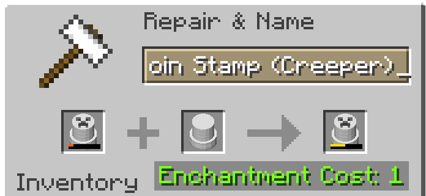

Coin stamp could have different kind of motives and are used to craft coins in the coin press.

## Crafting

To craft a basic coin stamp you need the following material:

- Copper, Gold, Iron, Steel or Netherite Nugget
- Copper, Gold, Iron, Steel or Netherite Rod (half size)

## Coin Stamp with Motive

With the basic coin stamp you are also able to craft coin stamps with different kind of motives.

## Repair

You can repair coin stamps with the same type or the same material of the stamp on an anvil.

