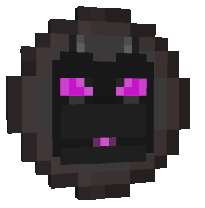
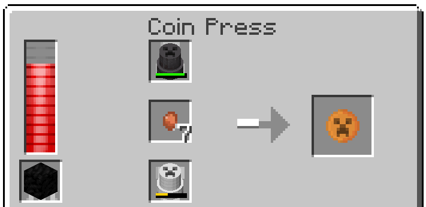
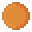
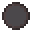

## Crafting

To craft a coin you need the following items:

- **1 x** [Coin Press](../coin_press/)
- **1..64 x** Corresponding Nugget like copper, gold, iron, steel or netherite
- **2 x** [Coin Stamps](../coin_stamps/) with the same motive
- **1 x** A fuel item like wood, coal, lave bucket, ...

## Material

Coins are available in the following 5 materials:

 Copper Token Coin 
 Gold Token Coin 
 Iron Token Coin 
 Steel Token Coin 
 Netherite Token Coin 
