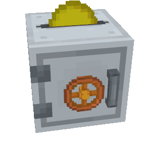

Piggy Banks exists in different kind of formats and colors and are used to store your coins.

## Crafting

The crafting recipe varies from piggy bank to piggy bank, but in general you need the following:

- **1 x** [Coin](../coins/)
- **7 x** Terracotta blocks in the color of the piggy bank
- **1 x** Dropped item

## Usage

### How to put coins in the piggy bank ?

Take any kind of [Coin](../coins/) in your hand and click on the placed piggy bank block.
The coin will be automatically transferred to your piggy bank.

Tip: If you want to transfer the whole stack instead of an single coin, just sneak / crouch and
click at the same time.

### How to check the balance of the piggy bank ?

Click with your empty hand on the piggy bank and it will tell you the amount which is currently
in your piggy bank.

### How to remove my coins from the piggy bank ?

Just like a normal piggy bank, destroy you piggy bank and it will drop all of your collected coins.
Note: The piggy bank itself will not be dropped and is just destroyed.

## Limitations

The piggy bank is limited internally to about 27 slots and tries to intelligent sort and stack the
given coins.
If the limit is reached you will get a message that your piggy bank is full.
